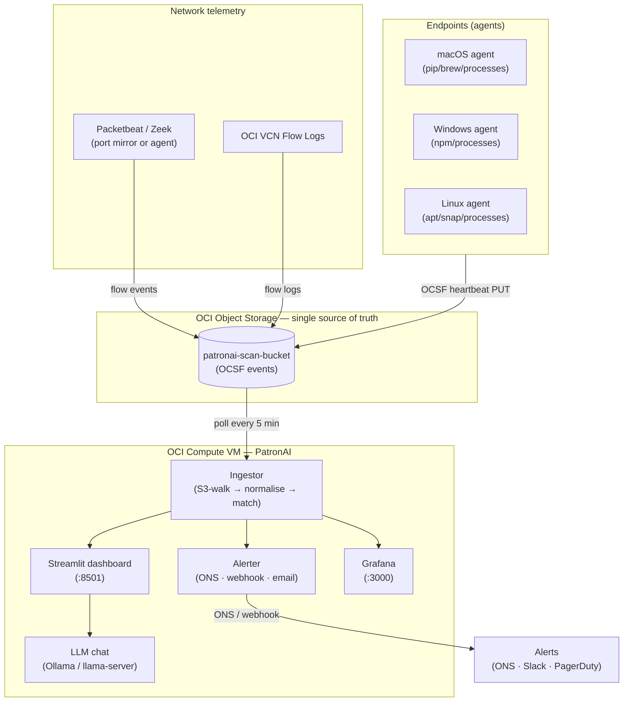

# PatronAI — Marauder Scan (OCI Edition)

> **AI Tool Shadow IT Scanner** — real-time visibility into every AI tool,
> model, and agent running in your organisation.

PatronAI continuously scans your environment for unauthorised or unmanaged
AI tool usage. It ingests VCN Flow Logs, Packetbeat, and Zeek telemetry,
normalises to OCSF, matches against 200+ provider signatures, and surfaces
findings in a real-time Streamlit dashboard with Grafana analytics.

---

## What it detects

| Category | Examples |
|----------|---------|
| AI APIs | OpenAI, Anthropic, Cohere, Mistral, Groq, Together |
| AI coding tools | GitHub Copilot, Cursor, Tabnine, Codeium, Continue |
| Local models | Ollama, LM Studio, Jan, GPT4All, llama.cpp |
| Agent frameworks | LangChain, AutoGen, CrewAI, n8n, Flowise |
| Vector databases | Chroma, FAISS, LanceDB, Qdrant, Milvus |
| MCP servers | Any MCP stdio/HTTP server process |

---

## Quick start

```bash
# Step 1 — Deploy OCI VM, transfer code, install Docker + LLM
bash deploy_to_oci.sh

# Step 2 — Create OCI resources (Object Storage, Customer Keys, ONS) + generate .env
bash prereqs_oci.sh

# Step 3 — Migrate data from source environment
bash ghost-ai-scanner/scripts/migrate_data.sh

# Step 4 — SSH into OCI VM and start
cd ghost-ai-scanner
bash scripts/start.sh
```

### Access

| Service | URL |
|---------|-----|
| PatronAI UI | `https://patronai.giggso.com/` |
| Grafana | `https://patronai.giggso.com/grafana/` |

---

## Architecture



**Data never leaves your OCI tenancy.** All telemetry writes to your own
OCI Object Storage bucket; the scanner reads from the bucket every scan
cycle; no third-party cloud plane.

---

## OCI Setup

### Prerequisites

- OCI account with a Compute VM (Oracle Linux 8 or Ubuntu 22.04)
- OCI CLI configured (`oci setup config`)
- SSH key for the OCI VM
- Ports 22, 80, 443 open in OCI Security List

### Deploy

```bash
# 1. Deploy codebase to OCI VM
bash deploy_to_oci.sh

# 2. Create OCI resources and generate .env
bash prereqs_oci.sh

# 3. Migrate data (if migrating from another environment)
bash ghost-ai-scanner/scripts/migrate_data.sh

# 4. Start
ssh -i your-key.pem opc@<OCI_IP>
cd ghost-ai-scanner
bash scripts/start.sh
```

---

## Environment variables

| Variable | Required | Default | Description |
|----------|----------|---------|-------------|
| `PATRONAI_BUCKET` | Yes | — | OCI Object Storage bucket name |
| `S3_ENDPOINT_URL` | Yes | — | OCI S3-compat endpoint URL |
| `COMPANY_NAME` | Yes | — | Display name in dashboard + reports |
| `COMPANY_SLUG` | Yes | — | URL-safe slug for storage paths |
| `ALLOWED_EMAILS` | Yes | — | Comma-separated login emails |
| `ADMIN_EMAILS` | Yes | — | Comma-separated admin emails |
| `AWS_ACCESS_KEY_ID` | Yes | — | OCI Customer Secret Key ID (boto3 var) |
| `AWS_SECRET_ACCESS_KEY` | Yes | — | OCI Customer Secret Key (boto3 var) |
| `AWS_REGION` | No | `us-chicago-1` | OCI region (boto3 variable name) |
| `CLOUD_PROVIDER` | No | `oci` | Cloud provider for network resolver |
| `ALERT_SNS_ARN` | No | — | OCI ONS topic OCID for alerts |
| `TRINITY_WEBHOOK_URL` | No | — | Slack/Teams webhook for alerts |
| `GRAFANA_URL` | No | — | Full Grafana base URL |
| `PUBLIC_HOST` | No | — | OCI VM public IP or DNS |
| `GF_SECURITY_ADMIN_PASSWORD` | Yes | — | Grafana admin password |

> **boto3 variable names:** `AWS_ACCESS_KEY_ID`, `AWS_SECRET_ACCESS_KEY`,
> and `AWS_REGION` are required environment variable names read by the
> Python boto3 S3 SDK. They store OCI credentials, not AWS credentials.

---

## File structure

```
PatronAI/
├── deploy_to_oci.sh                      # Deploy codebase Mac → OCI VM
├── prereqs_oci.sh                        # Create OCI resources + generate .env
├── oci-policy.json                       # OCI IAM policy for PatronAI
├── OCI_MIGRATION.md                      # Migration guide (source → OCI)
│
└── ghost-ai-scanner/
    ├── docker-compose.yml                # Production OCI stack
    ├── Dockerfile
    ├── Dockerfile.grafana
    ├── main.py
    ├── requirements.txt
    │
    ├── nginx/
    │   ├── nginx.conf                    # Reverse proxy config
    │   └── domaincert/                   # SSL certs (nginx.crt, nginx.key)
    │
    ├── config/
    │   ├── settings.json
    │   ├── authorized.csv
    │   └── unauthorized.csv
    │
    ├── scripts/
    │   ├── start.sh                      # Safe docker compose wrapper
    │   ├── setup.sh                      # OCI first-run setup + validation
    │   ├── migrate_data.sh               # Migrate data from source → OCI
    │   ├── prefetch_model.sh             # Pre-download LLM model
    │   └── patronai_mcp_server.py        # MCP server for Claude Desktop
    │
    ├── src/                              # Scanner engine
    ├── dashboard/                        # Streamlit UI
    ├── agent/                            # Endpoint agents
    └── tests/                            # Unit + integration tests
```

---

## OCI → AWS service mapping

| OCI | AWS equivalent | Used for |
|-----|---------------|---------|
| Object Storage | S3 | All scan data storage |
| Customer Secret Keys | IAM user + access keys | boto3 S3 authentication |
| OCI Notifications (ONS) | SNS | Alert delivery |
| OCI Email Delivery | SES | Alert emails |
| VCN Flow Logs | VPC Flow Logs | Network telemetry |
| Compute VM | EC2 | Hosting PatronAI |

---

## LLM Chat

PatronAI includes an AI chat panel powered by a local LLM. On first
`docker compose up`, it downloads LiquidAI/LFM2.5-1.2B-Thinking-GGUF
(~750 MB) into a named Docker volume. The dashboard opens immediately;
chat activates once the download finishes (~3–5 min).

To use a different model or external endpoint, set `LLM_MODEL_REPO`,
`LLM_BASE_URL`, and `LLM_API_KEY` in `.env`.

---

## Known limitations (OCI — developer backlog)

| Feature | Status |
|---------|--------|
| Network metadata resolver | In progress — EC2/ENI resolver being ported to OCI VNIC |
| ONS alert delivery | In progress — SNS dispatcher being ported to OCI ONS SDK |
| OCI Email Delivery | In progress — SES email module being ported |
| VCN Flow Log normaliser | Planned |

---

## Roadmap

| Feature | Status |
|---------|--------|
| OCI VNIC network resolver | In progress |
| Multi-tenancy | Planned |
| AWS Bedrock provider detection | Planned |
| Azure OpenAI provider detection | Planned |
| V2 MCP server — HTTP transport | Planned |

---

*Giggso Inc x TrinityOps.ai x AIRTaaS*
